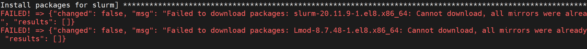

Slurm
======

⦾ **What to do if slurmd services do not start after running omnia.yml playbook?**

**Resolution**: Run the following command to manually restart slurmd services on the nodes ::

    systemctl restart slurmd

⦾ **What to do when Slurm services do not start automatically after the cluster reboots:**

**Resolution**:

* Manually restart the slurmd services on the kube_control_plane by running the following commands: ::

    systemctl restart slurmdbd
    systemctl restart slurmctld
    systemctl restart prometheus-slurm-exporter

* Run ``systemctl status slurmd`` to manually restart the following service on all the cluster nodes.

⦾ **What to do if new slurm node is not added to sinfo output of slurm control node when restart_slurm_services in omnia_config.yml is set to "false"?**

**Resolution**:

* Run the following command on slurm control node: ::

    systemctl restart slurmctld

* Verify if the slurm node was added, using: ::

    sinfo

⦾ **Why do Slurm services fail?**

**Potential Cause**: The ``slurm.conf`` is not configured properly.

**Resolution**:

1. Run the following commands: ::

     slurmdbd -Dvvv
     slurmctld -Dvvv

2. Refer the ``/var/lib/log/slurmctld.log`` file for more information.

⦾ **What causes the "Ports are Unavailable" error?**

**Potential Cause:** Slurm database connection fails.

**Resolution:**

1. Run the following commands: ::

     slurmdbd -Dvvv
     slurmctld -Dvvv

2. Refer the ``/var/lib/log/slurmctld.log`` file.

3. Check the output of ``netstat -antp | grep LISTEN`` for  PIDs in the listening state.

4. If PIDs are in the **Listening** state, kill the processes of that specific port.

5. Restart all Slurm services: ::

    slurmctl restart slurmctld on slurm_control_node
    systemctl restart slurmdbd on slurm_control_node
    systemctl restart slurmd on slurm_node

⦾ **What to do if slurmctld services fails during omnia.yml execution, when slurm_installaton_type is nfs_share?**

**Potential Cause**: This issue may arise due to internal network issues.

**Resolution**: Re-run the playbook with same configuration and verify the status of slurmctld service in the slurm control node.

⦾ **Why does the "TASK: Install packages for slurm" fail with the following error message?**

**Potential Cause**: This error can happen:

    * Due to intermittent connectivity issues with the EPEL8 repositories from where the Slurm packages are downloaded.
    * Due to Slurm packages not downloaded successfully during ``local_repo.yml`` execution.

**Resolution**:

    * While installing Slurm, Omnia recommends users to proceed with ``always`` or ``partial`` scenarios of ``repo_config`` in ``input/software_config.json``.
    * If the user still wants to proceed with the ``never`` scenario, they must wait for the EPEL8 repositories to be reachable and then re-run the ``local_repo.yml`` playbook to download and install the Slurm packages.
    * If the user doesn't want to wait, they can change ``repo_config`` in ``input/software_config.json`` to ``always`` or ``partial``, execute ``control_plane_cleanup.yml``, and then re-run ``local_repo.yml`` to download the Slurm packages. After the packages are downloaded successfully, users need to provision the cluster and run ``omnia.yml`` to install the slurm packages on the cluster nodes.