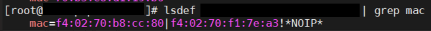
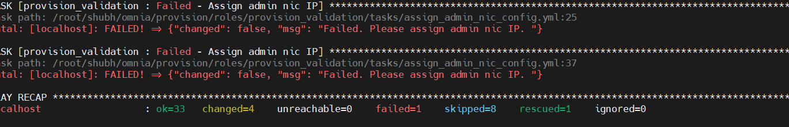

Known issues
==============

⦾ **Why doesn't my newly discovered server list a MAC ID in the cluster.nodeinfo table?**

Due to internal MAC ID conflicts on the target nodes, the MAC address will be listed against the target node using this format ``MAC ADDRESS 1 | MAC ADDRESS 2! *NOIP*`` in the xCAT node object.

⦾ **Hostname assignment by Omnia is not sequential (that is from 1-xx) when discovering nodes via BMC or switch-based methods**

Omnia does not maintain any order when assigning hostnames to target nodes.

⦾ **cluster nodes get updated to Rocky 8.8 automatically irrespective of the input parameters provided to provision_config.yml when provision_os is Rocky.**

**Potential Cause:** In Rocky Linux, online repos are enabled by default, and they always point to the latest Rocky repository (currently Rocky Linux 8.8).

**Resolution**: This will be addressed in a later release.

⦾ **Why does the task Assign admin NIC IP fail during provision.yml with errors?**

**Potential Cause:** Omnia validates the admin NIC IP on the control plane. If the user has not assigned an admin NIC IP in case of dedicated network interface type, an error message is returned. There is a parsing logic that is being applied on the blank IP and hence, the error displays twice.

**Resolution**: Ensure a control plane IP is assigned to the admin NIC.

⦾ **Kubernetes pods on the manager node are in CreateContainerConfigError and Calico Pods are in CrashLoopBackoff error after running omnia.yml.**

**Potential Cause:**

Calico pods are configured with the NIC name of the manager node. If the NIC name of the other nodes are not the same, the pods will throw an error and retry later.

**Workaround:**

The manager and cluster nodes should have connectivity over the same admin NIC.

⦾ **Why does the task ``cluster_preperation : Install sshpass`` fail during ``omnia.yml`` on cluster nodes running RHEL 8.5 and below versions.**

**Potential Cause**:
    * sshpass is not available in any of the repositories on the control plane.

**Resolution**:

   * Enable RedHat subscription or ensure that sshpass is available to install or download to the control plane (from any local repository).

⦾ **Why are some target servers not reachable after running PXE booting them?**

**Potential Causes**:

1. The server hardware does not allow for auto rebooting

2. PXE booting is hung on the node

**Resolution**:

1. Login to the iDRAC console to check if the server is stuck in boot errors (F1 prompt message). If true, clear the hardware error or disable POST (PowerOn Self Test).

2. Hard-reboot the server to bring up the server and verify that the boot process runs smoothly. (If it gets stuck again, disable PXE and try provisioning the server via iDRAC.)

⦾ **Why does the task 'Provision: Fetch the available subnets and netmasks' fail with 'no ipv4_secondaries present'?**

.. image:: ../images/SharedLomError.png

**Potential Cause**: If a shared LOM environment is in use, the management network/host network NIC may only have one IP assigned to it.

**Resolution**: Ensure that the NIC used for host and data connections has 2 IPs assigned to it.

⦾ **Why does provisioning RHEL 8.3 fail on some nodes with "dasbus.error.DBusError: 'NoneType' object has no attribute 'set_property'"?**

This error is known to RHEL and is being addressed `here <https://bugzilla.redhat.com/show_bug.cgi?id=1912898>`_. Red Hat has offered a user intervention `here <https://access.redhat.com/solutions/5872751>`_. Omnia recommends that in the event of this failure, any OS other than RHEL 8.3.

⦾ **Why is the Infiniband NIC down after provisioning the server?**

For servers running Rocky, enable the Infiniband NIC manually, use ``ifup <InfiniBand NIC>``.

Alternatively, run ``network.yml`` or  ``post_provision.yml`` (Only if the nodes are provisioned using Omnia) to activate the NIC.

⦾ **Why does the Task [infiniband_switch_config : Authentication failure response] fail with the message 'Status code was -1 and not [302]: Request failed: <urlopen error [Errno 111] Connection refused>' on Infiniband Switches when running infiniband_switch_config.yml?**

To configure a new Infiniband Switch, it is required that HTTP and JSON gateway be enabled. To verify that they are enabled, run:

``show web`` (To check if HTTP is enabled)

``show json-gw`` (To check if JSON Gateway is enabled)

To correct the issue, run:

``web http enable`` (To enable the HTTP gateway)

``json-gw enable`` (To enable the JSON gateway)

⦾ **Why does the task 'Initialize kubeadm' fail while running monitor.yml?**

This issue is caused by incompatibility between Rocky 8.7 and kubernetes due to cri-o. For more information, `click here <https://github.com/cri-o/cri-o/issues/6197>`_.

⦾ **Why does PXE boot fail with tftp timeout or service timeout errors?**

**Potential Causes**:

* RAID is configured on the server.

* Two or more servers in the same network have xCAT services running.

* The target cluster node does not have a configured PXE device with an active NIC.

**Resolution**:

1. Create a Non-RAID or virtual disk on the server.

2. Check if other systems except for the control plane have xcatd running. If yes, then stop the xCAT service using the following commands: ``systemctl stop xcatd``.

3. On the server, go to ``BIOS Setup -> Network Settings -> PXE Device``. For each listed device (typically 4), configure an active NIC under ``PXE device settings``

⦾ **Why do Kubernetes Pods show "ImagePullBack" or "ErrPullImage" errors in their status?**

**Potential Cause**:

    * The errors occur when the Docker pull limit is exceeded.
**Resolution**:

    * For ``omnia.yml`` and ``provision.yml`` : Provide the docker username and password for the Docker Hub account in the *omnia_config.yml* file and execute the playbook.

    * For HPC cluster, during ``omnia.yml execution``, a kubernetes secret 'dockerregcred' will be created in default namespace and patched to service account. User needs to patch this secret in their respective namespace while deploying custom applications and use the secret as imagePullSecrets in yaml file to avoid ErrImagePull. [Click here for more info](https://kubernetes.io/docs/tasks/configure-pod-container/pull-image-private-registry/)
.. note:: If the playbook is already executed and the pods are in **ImagePullBack** state, then run ``kubeadm reset -f`` in all the nodes before re-executing the playbook with the docker credentials.

⦾ **Why does the task 'Gather facts from all the nodes' stuck when re-running ``omnia.yml``?**

**Potential Cause**: Corrupted entries in the ``/root/.ansible/cp/`` folder. For more information on this issue, `check this out <https://github.com/ansible/ansible/issues/17349>`_!

**Resolution**: Clear the directory ``/root/.ansible/cp/`` using the following commands: ::

    cd /root/.ansible/cp/

    rm -rf *

Alternatively, run the task manually: ::

    cd omnia/utils/cluster
    ansible-playbook gather_facts_resolution.yml

⦾ **What to do after a reboot if kubectl commands return: ``The connection to the server head_node_ip:port was refused - did you specify the right host or port?``**

On the control plane or the manager node, run the following commands: ::

   swapoff -a

   systemctl restart kubelet

⦾ **What to do if the nodes in a Kubernetes cluster reboot:**

Wait for 15 minutes after the Kubernetes cluster reboots. Next, verify the status of the cluster using the following commands:

* ``kubectl get nodes`` on the manager node to get the real-time k8s cluster status.

* ``kubectl get pods  all-namespaces`` on the manager node to check which the pods are in the **Running** state.

* ``kubectl cluster-info`` on the manager node to verify that both the k8s master and kubeDNS are in the **Running** state.

⦾ **What to do when the Kubernetes services are not in the  Running  state:**

1. Run ``kubectl get pods  all-namespaces`` to verify that all pods are in the **Running** state.

2. If the pods are not in the **Running** state, delete the pods using the command:``kubectl delete pods <name of pod>``

3. Run the corresponding playbook that was used to install Kubernetes: ``omnia.yml``, ``jupyterhub.yml``, or ``kubeflow.yml``.

⦾ **Why do Kubernetes Pods stop communicating with the servers when the DNS servers are not responding?**

**Potential Cause**: The host network is faulty causing DNS to be unresponsive

**Resolution**:

1. In your Kubernetes cluster, run ``kubeadm reset -f`` on all the nodes.

2. On the management node, edit the ``omnia_config.yml`` file to change the Kubernetes Pod Network CIDR. The suggested IP range is 192.168.0.0/16. Ensure that the IP provided is not in use on your host network.

3. Set ``scheduler_type: "k8s"`` in ``input/omnia_config.yml`` and run ``omnia.yml``.

⦾ **Why does pulling images to create the Kubeflow timeout causing the 'Apply Kubeflow Configuration' task to fail?**

**Potential Cause**: Unstable or slow Internet connectivity.

**Resolution**:

1. Complete the PXE booting/format the OS on the manager and cluster nodes.

2. In the omnia_config.yml file, change the k8s_cni variable value from ``calico`` to ``flannel``.

3. Run the Kubernetes and Kubeflow playbooks.

⦾ **Why does the 'Initialize Kubeadm' task fail with 'nnode.Registration.name: Invalid value: \"<Host name>\"'?**

**Potential Cause**: The control_plane playbook does not support hostnames with an underscore in it such as 'mgmt_station'.

As defined in RFC 822, the only legal characters are the following:
1. Alphanumeric (a-z and 0-9): Both uppercase and lowercase letters are acceptable, and the hostname is case-insensitive. In other words, omnia.test is identical to OMNIA.TEST and Omnia.test.

2. Hyphen (-): Neither the first nor the last character in a hostname field should be a hyphen.

3. Period (.): The period should be used only to delimit fields in a hostname (e.g., dvader.empire.gov)

⦾ **What to do when Kubeflow pods are in 'ImagePullBackOff' or 'ErrImagePull' status after executing kubeflow.yml:**

**Potential Cause**: Your Docker pull limit has been exceeded. For more information, click [here](https://www.docker.com/increase-rate-limits)

1. Delete Kubeflow deployment by executing the following command in manager node: ``kfctl delete -V -f /root/k8s/omnia-kubeflow/kfctl_k8s_istio.v1.0.2.yaml``

2. Re-execute ``kubeflow.yml`` after 8-9 hours

⦾ **What to do when omnia.yml fail with 'Error: kinit: Connection refused while getting default ccache' while completing the security role?**

1. Start the sssd-kcm.socket: ``systemctl start sssd-kcm.socket``

2. Re-run ``omnia.yml``

⦾ **What to do when Slurm services do not start automatically after the cluster reboots:**

* Manually restart the slurmd services on the manager node by running the following commands: ::

    systemctl restart slurmdbd
    systemctl restart slurmctld
    systemctl restart prometheus-slurm-exporter

* Run ``systemctl status slurmd`` to manually restart the following service on all the cluster nodes.

⦾ **Why do Slurm services fail?**

**Potential Cause**: The ``slurm.conf`` is not configured properly.

Recommended Actions:

1. Run the following commands: ::

     slurmdbd -Dvvv
     slurmctld -Dvvv

2. Refer the ``/var/lib/log/slurmctld.log`` file for more information.

⦾ **What causes the "Ports are Unavailable" error?**

**Potential Cause:** Slurm database connection fails.

**Recommended Actions:**

1. Run the following commands:::

     slurmdbd -Dvvv
     slurmctld -Dvvv

2. Refer the ``/var/lib/log/slurmctld.log`` file.

3. Check the output of ``netstat -antp | grep LISTEN`` for  PIDs in the listening state.

4. If PIDs are in the **Listening** state, kill the processes of that specific port.

5. Restart all Slurm services: ::

    slurmctl restart slurmctld on manager node

    systemctl restart slurmdbd on manager node

    systemctl restart slurmd on compute node

⦾ **Why does the task 'nfs_client: Mount NFS client' fail with ``Failed to mount NFS client. Make sure NFS Server is running on IP xx.xx.xx.xx``?**

**Potential Cause**:

* The required services for NFS may not be running:

    - nfs
    - rpc-bind
    - mountd

**Resolution**:

* Enable the required services using ``firewall-cmd  --permanent  --add-service=<service name>`` and then reload the firewall using ``firewall-cmd  --reload``.

⦾ **What to do when omnia.yml fails with nfs-server.service might not be running on NFS Server. Please check or start services``?**

**Potential Cause**: nfs-server.service is not running on the target node.

**Resolution**: Use the following commands to bring up the service: ::

    systemctl start nfs-server.service

    systemctl enable nfs-server.service

⦾ **Why does the task 'Install Packages' fail on the NFS node with the message: ``Failure in talking to yum: Cannot find a valid baseurl for repo: base/7/x86_64.``**

**Potential Cause**:

    There are connections missing on the NFS node.

**Resolution**:

        Ensure that there are 3 NICs being used on the NFS node:

                1. For provisioning the OS

                2. For connecting to the internet (Management purposes)

                3. For connecting to PowerVault (Data Connection)

⦾ **Why do pods and images appear to get deleted automatically?**

**Potential Cause**:

Lack of space in the root partition (/) causes Linux to clear files automatically (Use ``df -h`` to diagnose the issue).

  **Resolution**:

* Delete large, unused files to clear the root partition (Use the command ``find / -xdev -size +5M | xargs ls -lh | sort -n -k5`` to identify these files). Before running ``monitor.yml``, it is recommended to have a minimum of 50% free space in the root partition.

* Once the partition is cleared, run ``kubeadm reset -f``

* Re-run ``monitor.yml``

⦾ **What to do when the JupyterHub or Prometheus UI is not accessible:**

Run the command ``kubectl get pods  namespace default`` to ensure **nfs-client** pod and all Prometheus server pods are in the **Running** state.

⦾ **What to do if PowerVault throws the error: ``Error: The specified disk is not available. - Unavailable disk (0.x) in disk range '0.x-x'``:**

1. Verify that the disk in question is not part of any pool: ``show disks``

2. If the disk is part of a pool, remove it and try again.

⦾ **Why does PowerVault throw the error: ``You cannot create a linear disk group when a virtual disk group exists on the system.``?**

At any given time only one type of disk group can be created on the system. That is, all disk groups on the system have to exclusively be linear or virtual. To fix the issue, either delete the existing disk group or change the type of pool you are creating.

⦾ **Why does the task 'nfs_client: Mount NFS client' fail with ``No route to host``?**

**Potential Cause**:

* There's a mismatch in the share path listed in ``/etc/exports`` and in ``omnia_config.yml`` under ``nfs_client_params``.

**Resolution**:

* Ensure that the input paths are a perfect match down to the character to avoid any errors.

⦾ **Why is my NFS mount not visible on the client?**

**Potential Cause**: The directory being used by the client as a mount point is already in use by a different NFS export.

**Resolution**: Verify that the directory being used as a mount point is empty by using ``cd <client share path> | ls`` or ``mount | grep <client share path>``. If empty, re-run the playbook.

.. image:: ../images/omnia_NFS_mount_fcfs.png

⦾ **Why does the ``BeeGFS-client`` service fail?**

**Potential Causes**:

1. SELINUX may be enabled. (use ``sestatus`` to diagnose the issue)

2. Ports 8008, 8003, 8004, 8005 and 8006 may be closed. (use ``systemctl status beegfs-mgmtd, systemctl status beegfs-meta, systemctl status beegfs-storage`` to diagnose the issue)

3. The BeeGFS set up may be incompatible with RHEL.

**Resolution**:

1. If SELinux is enabled, update the file ``/etc/sysconfig/selinux`` and reboot the server.

2. Open all ports required by BeeGFS: 8008, 8003, 8004, 8005 and 8006

3. Check the [support matrix for RHEL or Rocky](../Support_Matrix/Software/Operating_Systems) to verify your set-up.

4. For further insight into the issue, check out ``/var/log/beegfs-client.log`` on nodes where the BeeGFS client is running.

⦾ **Why does the task 'security: Authenticate as admin' fail?**

**Potential Cause**:
The required services are not running on the node. Verify the service status using:::

    systemctl status sssd-kcm.socket

    systemctl status sssd.service

**Resolution**:

* Restart the services using:::

    systemctl start sssd-kcm.socket
    systemctl start sssd.service

* Re-run ``omnia.yml`` using: ::

    ansible-playbook omnia.yml

⦾ **Why does installing FreeIPA fail on RHEL servers?**

.. image:: ../images/FreeIPA_RHEL_Error.png

**Potential Causes**: Required repositories may not be enabled by your red hat subscription.

**Resolution**: Enable all required repositories via your red hat subscription.

⦾ **Why would FreeIPA server/client installation fail?**

**Potential Cause**:

The hostnames of the manager and login nodes are not set in the correct format.

**Resolution**:

If you have enabled the option to install the login node in the cluster, set the hostnames of the nodes in the format: *hostname.domainname*. For example, *manager.omnia.test* is a valid hostname for the login node. **Note**: To find the cause for the failure of the FreeIPA server and client installation, see *ipaserver-install.log* in the manager node or */var/log/ipaclient-install.log* in the login node.

⦾ **Why does FreeIPA installation fail on the control plane when the public NIC provided is static?**

**Potential Cause**: The network config file for the public NIC on the control plane does not define any DNS entries.

**Resolution**: Ensure the fields ``DNS1`` and ``DNS2`` are updated appropriately in the file ``/etc/sysconfig/network-scripts/ifcfg-<NIC name>``.

⦾ **What to do when JupyterHub pods are in 'ImagePullBackOff' or 'ErrImagePull' status after executing jupyterhub.yml:**

**Potential Cause**: Your Docker pull limit has been exceeded. For more information, `click here <https://www.docker.com/increase-rate-limits>`_.

1. Delete Jupyterhub deployment by executing the following command in manager node: ``helm delete jupyterhub -n jupyterhub``

2. Re-execute ``jupyterhub.yml`` after 8-9 hours.

⦾ **What to do if NFS clients are unable to access the share after an NFS server reboot?**

Reboot the NFS server (external to the cluster) to bring up the services again: ::

    systemctl disable nfs-server
    systemctl enable nfs-server
    systemctl restart nfs-server

⦾  **Why do Kuberneteschildnode & kubernetesnodes log as Pass in the database even if there are nodes in the Ready,Schedulingdisabled state?**

**Potential Cause**:  Omnia telemetry considers ``Ready,SchedulingDisabled`` as a Ready state of Kubernetes nodes . So, even if the ``kubectl get nodes`` command shows any node’s state as ``Ready,SchedulingDisabled``, the entry in DB for  ``Kuberneteschildnode`` & ``kubernetesnodes`` will be logged as Pass instead of Fail.