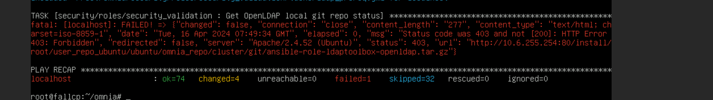
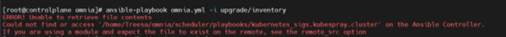
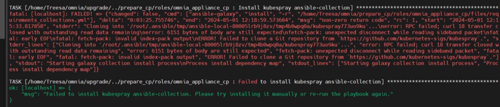
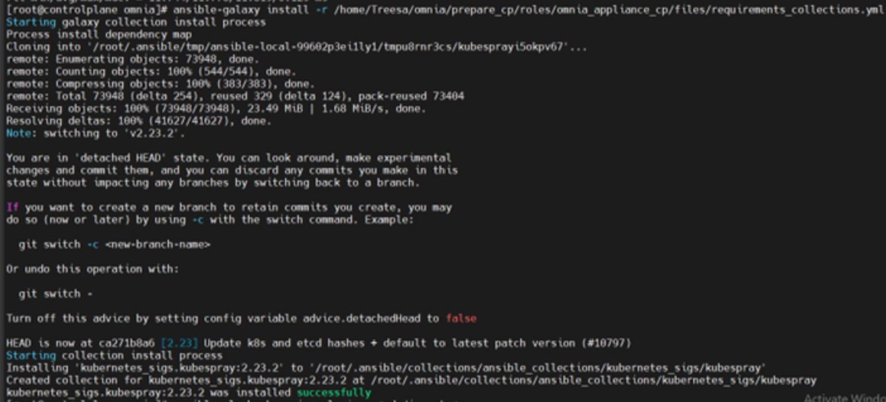
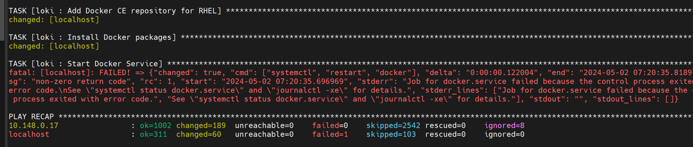

Known issues
==============

⦾ **Why doesn't my newly discovered server list a MAC ID in the cluster.nodeinfo table?**

Due to internal MAC ID conflicts on the target nodes, the MAC address will be listed against the target node using this format ``MAC ADDRESS 1 | MAC ADDRESS 2! *NOIP*`` in the xCAT node object.

.. image:: ../images/MACConflict.png

⦾ **Why does the task Assign admin NIC IP fail during discovery_provision.yml with errors?**

.. image:: ../images/AdminNICErrors.png

**Potential Cause:** Omnia validates the admin NIC IP on the control plane. If the user has not assigned an admin NIC IP in case of dedicated network interface type, an error message is returned. There is a parsing logic that is being applied on the blank IP and hence, the error displays twice.

**Resolution**: Ensure a control plane IP is assigned to the admin NIC.

⦾ **Why are some target servers not reachable after PXE booting them?**

**Potential Causes**:

1. The server hardware does not allow for auto rebooting

2. The process of PXE booting the node has stalled.

**Resolution**:

1. Login to the iDRAC console to check if the server is stuck in boot errors (F1 prompt message). If true, clear the hardware error or disable POST (PowerOn Self Test).

2. Hard-reboot the server to bring up the server and verify that the boot process runs smoothly. (If it gets stuck again, disable PXE and try provisioning the server via iDRAC.)

⦾ **Why does the Task [infiniband_switch_config : Authentication failure response] fail with the message 'Status code was -1 and not [302]: Request failed: <urlopen error [Errno 111] Connection refused>' on Infiniband Switches when running infiniband_switch_config.yml?**

To configure a new Infiniband Switch, HTTP and JSON gateway must be enabled. To verify that they are enabled, run:

To check if HTTP is enabled: ``show web``

To check if JSON Gateway is enabled: ``show json-gw``

To correct the issue, run:

To enable the HTTP gateway: ``web http enable``

To enable the JSON gateway: ``json-gw enable``

⦾ **Why does PXE boot fail with tftp timeout or service timeout errors?**

**Potential Causes**:

* RAID is configured on the server.

* Two or more servers in the same network have xCAT services running.

* The target cluster node does not have a configured PXE device with an active NIC.

**Resolution**:

1. Create a Non-RAID or virtual disk on the server.

2. Check if other systems except for the control plane have xcatd running. If yes, then stop the xCAT service using the following commands: ``systemctl stop xcatd``.

3. On the server, go to **BIOS Setup -> Network Settings -> PXE Device**. For each listed device (typically 4), configure an active NIC under ``PXE device settings``

⦾ **Why does running local_repo.yml fail with connectivity errors?**

**Potential Cause**: The control plane was unable to reach a required online resource due to a network glitch.

**Resolution**: Verify all connectivity and re-run the playbook.

⦾ **Why does any script that installs software fail with "The checksum for <software repository path> did not match."**?

**Potential Cause**: A local repository for the software was not configured by ``local_repo.yml``.

**Resolution**:

    * Delete the tarball/image/deb of the software from ``<repo_path>/cluster/tarball``.
    * Re-run ``local_repo.yml``.
    * Re-run the script to install the software.

⦾ **Why do Kubernetes Pods show "ImagePullBack" or "ErrPullImage" errors in their status?**

**Potential Cause**:

    * The errors occur when the Docker pull limit is exceeded.
**Resolution**:

    * Ensure that the ``docker_username`` and ``docker_password`` are provided in ``input/provision_config_credentials.yml``.

    * For a HPC cluster, during ``omnia.yml`` execution, a kubernetes secret 'dockerregcred' will be created in default namespace and patched to service account. User needs to patch this secret in their respective namespace while deploying custom applications and use the secret as imagePullSecrets in yaml file to avoid ErrImagePull. `Click here for more info. <https://kubernetes.io/docs/tasks/configure-pod-container/pull-image-private-registry>`_

.. note:: If the playbook is already executed and the pods are in **ImagePullBack** state, then run ``kubeadm reset -f`` in all the nodes before re-executing the playbook with the docker credentials.

⦾ **Why does the task 'Gather facts from all the nodes' get stuck when re-running ``omnia.yml``?**

**Potential Cause**: Corrupted entries in the ``/root/.ansible/cp/`` folder. For more information on this issue, `check this out <https://github.com/ansible/ansible/issues/17349>`_!

**Resolution**: Clear the directory ``/root/.ansible/cp/`` using the following commands: ::

    cd /root/.ansible/cp/

    rm -rf *

Alternatively, run the task manually: ::

    cd omnia/utils/cluster
    ansible-playbook gather_facts_resolution.yml

⦾ **What to do if the nodes in a Kubernetes cluster reboot:**

Wait for 15 minutes after the Kubernetes cluster reboots. Next, verify the status of the cluster using the following commands:

* ``kubectl get nodes`` on the kube_control_plane to get the real-time k8s cluster status.

* ``kubectl get pods  all-namespaces`` on the kube_control_plane to check which the pods are in the **Running** state.

* ``kubectl cluster-info`` on the kube_control_plane to verify that both the k8s master and kubeDNS are in the **Running** state.

⦾ **What to do when the Kubernetes services are not in the  Running  state:**

1. Run ``kubectl get pods  all-namespaces`` to verify that all pods are in the **Running** state.

2. If the pods are not in the **Running** state, delete the pods using the command:``kubectl delete pods <name of pod>``

3. Run the corresponding playbook that was used to install Kubernetes: ``omnia.yml``, ``jupyterhub.yml``, or ``kubeflow.yml``.

⦾ **Why do Kubernetes Pods stop communicating with the servers when the DNS servers are not responding?**

**Potential Cause**: The host network is faulty causing DNS to be unresponsive

**Resolution**:

1. In your Kubernetes cluster, run ``kubeadm reset -f`` on all the nodes.

2. On the management node, edit the ``omnia_config.yml`` file to change the Kubernetes Pod Network CIDR. The suggested IP range is 192.168.0.0/16. Ensure that the IP provided is not in use on your host network.

3. List k8s in ``input/software_config.json`` and re-run ``omnia.yml``.

⦾ **What to do if pulling the Kserve inference model fail with "Unable to fetch image "kserve/sklearnserver:v0.11.2": failed to resolve image to digest: Get "https://index.docker.io/v2/": dial tcp 3.219.239.5:443: i/o timeout."?**

1. Edit the kubernetes configuration map: ::

        kubectl edit configmap -n knative-serving config-deployment

2. Add docker.io and index.docker.io as part of the registries-skipping-tag-resolving.

For more information, `click here. <https://github.com/kserve/kserve/issues/3372>`_

⦾ **Why does the 'Initialize Kubeadm' task fail with 'nnode.Registration.name: Invalid value: \"<Host name>\"'?**

**Potential Cause**: The control_plane playbook does not support hostnames with an underscore in it such as 'mgmt_station'.

As defined in RFC 822, the only legal characters are the following:
1. Alphanumeric (a-z and 0-9): Both uppercase and lowercase letters are acceptable, and the hostname is not case-sensitive. In other words, omnia.test is identical to OMNIA.TEST and Omnia.test.

2. Hyphen (-): Neither the first nor the last character in a hostname field should be a hyphen.

3. Period (.): The period should be used only to delimit fields in a hostname (For example, dvader.empire.gov)

⦾ **What to do when Kubeflow pods are in 'ImagePullBackOff' or 'ErrImagePull' status after executing kubeflow.yml?**

**Potential Cause**: Your Docker pull limit has been exceeded. For more information, `click here. <https://www.docker.com/increase-rate-limits>`_

1. Delete Kubeflow deployment by executing the following command in kube_control_plane: ``kfctl delete -V -f /root/k8s/omnia-kubeflow/kfctl_k8s_istio.v1.0.2.yaml``

2. Re-execute ``kubeflow.yml`` after 8-9 hours

⦾ **What to do when omnia.yml fails while completing the security role, and returns the following error message: 'Error: kinit: Connection refused while getting default cache'?**

1. Start the sssd-kcm.socket: ``systemctl start sssd-kcm.socket``

2. Re-run ``omnia.yml``

⦾ **What to do if slurmd services do not start after running ``omnia.yml`` playbook?**

Run the following command to manually restart slurmd services on the nodes ::

    systemctl restart slurmd

⦾ **What to do when Slurm services do not start automatically after the cluster reboots:**

* Manually restart the slurmd services on the kube_control_plane by running the following commands: ::

    systemctl restart slurmdbd
    systemctl restart slurmctld
    systemctl restart prometheus-slurm-exporter

* Run ``systemctl status slurmd`` to manually restart the following service on all the cluster nodes.

⦾ **What to do if new slurm node is not added to sinfo output of slurm control node when restart_slurm_services in omnia_config.yml is set to ``false``?**

* Run the following command on slurm control node: ::

    systemctl restart slurmctld

* Verify if the slurm node was added, using: ::

    sinfo

⦾ **Why do Slurm services fail?**

**Potential Cause**: The ``slurm.conf`` is not configured properly.

Recommended Actions:

1. Run the following commands: ::

     slurmdbd -Dvvv
     slurmctld -Dvvv

2. Refer the ``/var/lib/log/slurmctld.log`` file for more information.

⦾ **What causes the "Ports are Unavailable" error?**

**Potential Cause:** Slurm database connection fails.

**Recommended Actions:**

1. Run the following commands:::

     slurmdbd -Dvvv
     slurmctld -Dvvv

2. Refer the ``/var/lib/log/slurmctld.log`` file.

3. Check the output of ``netstat -antp | grep LISTEN`` for  PIDs in the listening state.

4. If PIDs are in the **Listening** state, kill the processes of that specific port.

5. Restart all Slurm services: ::

    slurmctl restart slurmctld on slurm_control_node

    systemctl restart slurmdbd on slurm_control_node

    systemctl restart slurmd on slurm_node

⦾ **Why does the task 'nfs_client: Mount NFS client' fail with ``Failed to mount NFS client. Make sure NFS Server is running on IP xx.xx.xx.xx``?**

**Potential Cause**:

* The required services for NFS may not have been running:

    - nfs
    - rpc-bind
    - mountd

**Resolution**:

* Enable the required services using ``firewall-cmd  --permanent  --add-service=<service name>`` and then reload the firewall using ``firewall-cmd  --reload``.

⦾ **What to do when omnia.yml execution fails with nfs-server.service might not be running on NFS Server. Please check or start services?**

**Potential Cause**: nfs-server.service is not running on the target node.

**Resolution**: Use the following commands to bring up the service: ::

    systemctl start nfs-server.service

    systemctl enable nfs-server.service

⦾ **Why does the task `configure registry: Start and enable nerdctl-registry service` fail with "Job for nerdctl-registry.service failed because the control process exited with error code"?**

.. image:: ../images/nerdctlError.png

**Potential Cause**:

    * The subnet 10.4.0.0/24 has been assigned to the admin, bmc, or additional network. nerdctl uses this subnet by default and cannot be assigned to any other interface in the system.
    * The docker pull limit has been breached.

**Resolution**:

    * Reassign the conflicting network to a different subnet.
    * Update ``input/provision_config_credentials.yml`` with the ``docker_username`` and ``docker_password``.

⦾ **Why does the task 'Install Packages' fail on the NFS node with the message: ``Failure in talking to yum: Cannot find a valid baseurl for repo: base/7/x86_64.``**

**Potential Cause**:

    There are connections missing on the NFS node.

**Resolution**:

        Ensure that there are 3 NICs being used on the NFS node:

                1. For provisioning the OS

                2. For connecting to the internet (Management purposes)

                3. For connecting to PowerVault (Data Connection)

⦾ **What to do when the JupyterHub or Prometheus UI is not accessible:**

Run the command ``kubectl get pods  namespace default`` to ensure **nfs-client** pod and all Prometheus server pods are in the **Running** state.

⦾ **What to do if PowerVault throws the error: ``Error: The specified disk is not available. - Unavailable disk (0.x) in disk range '0.x-x'``:**

1. Verify that the disk in question is not part of any pool using: ``show disks``

2. If the disk is part of a pool, remove it and try again.

⦾ **Why does PowerVault throw the error: ``You cannot create a linear disk group when a virtual disk group exists on the system.``?**

At any given time only one type of disk group can be created on the system. That is, all disk groups on the system have to exclusively be linear or virtual. To fix the issue, either delete the existing disk group or change the type of pool you are creating.

⦾ **Why does the task 'nfs_client: Mount NFS client' fail with the message ``No route to host``?**

**Potential Cause**:

* There's a mismatch in the share path listed in ``/etc/exports`` and in ``omnia_config.yml`` under ``nfs_client_params``.

**Resolution**:

* Ensure that the input paths are a perfect match to avoid any errors.

⦾ **Why is my NFS mount not visible on the client?**

**Potential Cause**: The directory being used by the client as a mount point is already in use by a different NFS export.

**Resolution**: Verify that the directory being used as a mount point is empty by using ``cd <client share path> | ls`` or ``mount | grep <client share path>``. If empty, re-run the playbook.

.. image:: ../images/omnia_NFS_mount_fcfs.png

⦾ **Why does the ``BeeGFS-client`` service fail?**

**Potential Causes**:

1. SELINUX may be enabled. (use ``sestatus`` to diagnose the issue)

2. Ports 8008, 8003, 8004, 8005 and 8006 may be closed. (use ``systemctl status beegfs-mgmtd, systemctl status beegfs-meta, systemctl status beegfs-storage`` to diagnose the issue)

3. The BeeGFS set up may be incompatible with RHEL.

**Resolution**:

1. If SELinux is enabled, update the file ``/etc/sysconfig/selinux`` and reboot the server.

2. Open all ports required by BeeGFS: 8008, 8003, 8004, 8005 and 8006

3. Check the `support matrix for RHEL or Rocky <../Overview/SupportMatrix/OperatingSystems/index.html>`_ to verify your set-up.

4. For further insight into the issue, check out ``/var/log/beegfs-client.log`` on nodes where the BeeGFS client is running.

⦾ **Why does the task 'security: Authenticate as admin' fail?**

**Potential Cause**:
The required services are not running on the node. Verify the service status using: ::

    systemctl status sssd-kcm.socket

    systemctl status sssd.service

**Resolution**:

* Restart the services using:  ::

        systemctl start sssd-kcm.socket
        systemctl start sssd.service

* Re-run ``omnia.yml`` using: ::

        ansible-playbook omnia.yml

⦾ **Why would FreeIPA server/client installation fail? (version 1.5 and below)**

**Potential Cause**:

The hostnames of the auth server nodes are not configured in the correct format.

**Resolution**:

If you have enabled the option to install the login node in the cluster, set the hostnames of the nodes in the format: *hostname.domainname*. For example, *authserver_node.omnia.test* is a valid hostname for the auth server node.

.. note:: To find the cause for the failure of the FreeIPA server and client installation, see *ipaserver-install.log* in the auth server.

⦾ **What to do when JupyterHub pods are in 'ImagePullBackOff' or 'ErrImagePull' status after executing jupyterhub.yml:**

**Potential Cause**: Your Docker pull limit has been exceeded. For more information, `click here <https://www.docker.com/increase-rate-limits>`_.

1. Delete Jupyterhub deployment by executing the following command in kube_control_plane: ``helm delete jupyterhub -n jupyterhub``

2. Re-execute ``jupyterhub.yml`` after 8-9 hours.

⦾ **What to do if NFS clients are unable to access the share after an NFS server reboot?**

Reboot the NFS server (external to the cluster) to bring up the services again: ::

    systemctl disable nfs-server
    systemctl enable nfs-server
    systemctl restart nfs-server

⦾  **Why do Kuberneteschildnode & kubernetesnodes log as Pass in the database even if there are nodes in the Ready,Schedulingdisabled state?**

**Potential Cause**:  Omnia telemetry considers ``Ready,SchedulingDisabled`` as a Ready state of Kubernetes nodes . So, even if the ``kubectl get nodes`` command shows any node’s state as ``Ready,SchedulingDisabled``, the entry in DB for  ``Kuberneteschildnode`` & ``kubernetesnodes`` will be logged as Pass instead of Fail.

⦾ **What to do if omnia.yml playbook execution fails with MetalLB, a load-balancer for bare metal Kubernetes cluster?**

**Resolution**:

If your ``omnia.yml`` playbook execution fails while waiting for the MetalLB controller to be up and running, you need to wait for the MetalLB pods to come to running state and then re-run ``omnia.yml/scheduler.yml``.

⦾ **What to do if omnia.yml playbook execution fails to execute ``kubeadm join`` or ``kubeadm init`` command?**

**Resolution**:

If kubeadm join/kubeadm init command fails, either one of the following should be done:

    * Re-run ``omnia.yml/scheduler.yml``.
    * Run ``kubeadm reset -f`` on the node where kubeadm join/kubeadm init command fails and run ``omnia.yml/scheduler.yml``.
    * Reset cluster using ``utils/reset_cluster_configuration.yml`` and then run ``scheduler.yml/omnia.yml``.

⦾ **What to do if local_repo.yml execution fails with the following error:**

.. image:: ../images/local_repo_permissions_error.png

**Potential Cause**: Executing ``local_repo.yml`` with ``repo_store_path`` set as an NFS share, but lacking the necessary permissions to access it from the control plane.

**Resolution**: Provide the required (read, write, and execute) permissions for the NFS share. Verify the permissions of NFS share from the root user of the control plane.

⦾ **What to do if omnia.yml execution fails with a "403: Forbidden" error when an NFS share is provided as the repo_store_path?**

**Potential Cause**: For omnia.yml execution, the NFS share folder provided in repo_store_path must have 755 permissions.

**Resolution**: Ensure that the NFS share folder provided as the repo_store_path has 755 permissions, and re-run ``omnia.yml``.

⦾ **omnia.yml or scheduler.yml playbook execution fails with the following error:**

.. image:: ../images/kubespray_error.png

**Potential Cause**: This error occurs when the Kubespray collection is not installed during the execution of ``prepare_cp.yml``.

**Resolution**: Re-run ``prepare_cp.yml``.

⦾ **NFS-client provisioner is in "ContainerCreating" or "CrashLoopBackOff" state.**

.. image:: ../images/NFS_container_creating_error.png

.. image:: ../images/NFS_crash_loop_back_off_error.png

**Potential Cause**: This issue usually occurs when ``server_share_path`` given in ``storage_config.yml`` for ``k8s_share`` does not have an NFS server running.

**Resolution**:

    * Ensure that ``storage.yml`` is executed on the same inventory which is being used for ``scheduler.yml``.
    * Ensure that ``server_share_path`` mentioned in ``storage_config.yml`` for ``k8s_share: true`` has an active nfs_server running on it.

⦾ **Nfs-client provisioner is in "ContainerCreating" or "CrashLoopBackOff" state and ``kubectl describe <pod_name>`` shows the following output:**

.. image:: ../images/NFS_helm_23743.png

**Potential Cause**: This is a known issue. For more information, click `here. <https://github.com/helm/charts/issues/23743>`_

**Resolution**:

    1. Wait for some time for the pods to come up. **OR**
    2. Do the following:

        * Run the following command to delete the pod: ::

            kubectl delete pod <pod_name> -n <namespace>

        * Post deletion, the pod will be restarted and it will come to running state.

⦾ **What to do if slurmctld services fails when ``slurm_installaton_type`` is nfs_share during omnia.yml execution?**

**Potential Cause**: This issue may arise due to internal network issues.

**Resolution**: Re-run the playbook with same configuration and verify the status of slurmctld service in the slurm control node.

⦾ **Why does the task ‘Parse and Download: Display Failed Packages’ fail while running prepare_upgrade.yml?**

.. image:: ../images/upgrade_failed_packages.png

**Potential Cause**: This issue may arise while setting up of local repo for Omnia v1.6 and can occur due to internet connection issues on control plane.

**Resolution**: Verify that the internet connectivity on control plane is stable and re-run the ``prepare_upgrade.yml`` playbook.

⦾ **Why does omnia.yml (or upgrade.yml, in case of upgrade) fail with an error “Unable to retrieve file contents. Could not find or access... kubernetes_sigs.kubespray.cluster on the Ansible Controller”?**

**Potential Cause**: This issue could occur when the task *‘prepare_cp/roles/omnia_appliance_cp: Install Kubespray ansible-collection’* in ``prepare_upgrade.yml`` silently passes, without installing the Kubespray ansible-collection. This can happen due to unstable internet connectivity on control plane during installation.

**Resolution**: Manually try to install the Kubespray ansible-collection as shown below and re-run the ``omnia.yml`` playbook (or ``upgrade.yml`` playbook in case of upgrade):

⦾ **Why does the task ‘loki: Start Docker Service’ fail at “Job for docker.service failed because the control process exited with error code” while running upgrade.yml?**

**Potential Cause**: This issue could occur when the ‘docker0’ interface is already bound to a zone in the firewall settings and Docker tries to use this interface, resulting in a ‘Zone Conflict’.

**Resolution**: Perform the following steps to adjust your firewall settings, allowing Docker to utilize the 'docker0' interface without encountering conflicts.

1. Run the following command to check which zone the ‘docker0’ interface is bound to: ::

        firewall-cmd --get-zone-of-interface=docker0

   If the command output shows a zone other than Docker, then you need to remove docker0 interface from the current zone and add it to the ‘Docker’ zone.

2. Run the following command to remove docker0 interface from its current zone: ::

        sudo firewall-cmd --zone=<zone_name> --remove-interface=docker0

   Where <zone_name> is the name of the zone where docker0 interface is currently present.

3. To check whether Docker zone exists already, run the following command:

    ::

    firewall-cmd --get-zones

    * If docker zone doesn’t exist, create a new docker zone using the following command:

        ::

            sudo firewall-cmd --new-zone=docker --permanent

    * If docker zone exists already, add the docker0 interface using the following command:

        ::

            sudo firewall-cmd --zone=docker --add-interface=docker0 --permanent

4. Reload the firewall to apply changes, using the following command: ::

        sudo firewall-cmd --reload

5. Restart docker service to ensure it picks up the changes, using the following command: ::

        sudo systemctl restart docker

6. Finally, run the following command to ensure docker service is active and running: ::

        systemctl status docker

After performing all the above steps, re-run ``upgrade.yml`` playbook.