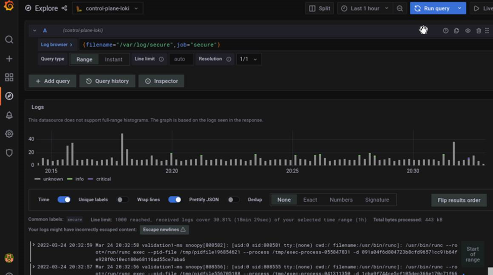

Troubleshooting guide
============================

Control plane logs
---------------------------

All log files can be viewed via the Dashboard tab ( |Dashboard| ) on the grafana UI. The Default Dashboard displays ``omnia.log`` and ``syslog``. Custom dashboards can be created per user requirements.

Below is a list of all logs available to Loki and can be accessed on the dashboard:

.. csv-table:: Parameters
   :file: ../Tables/ControlPlaneLogs.csv
   :header-rows: 1
   :keepspace:

Provisioning logs
--------------------

Logs pertaining to provisioning can be viewed in ``/var/log/xcat/cluster.log`` on the target nodes.

Logs of individual containers
--------------------------------------------
   1. A list of namespaces and their corresponding pods can be obtained using:
      ``kubectl get pods -A``
   2. Get a list of containers for the pod in question using:
      ``kubectl get pods <pod_name> -o jsonpath='{.spec.containers[*].name}'``
   3. Once you have the namespace, pod and container names, run the below command to get the required logs:
      ``kubectl logs pod <pod_name> -n <namespace> -c <container_name>``

Connecting to internal databases
------------------------------------
* TimescaleDB
    * Go inside the pod: ``kubectl exec -it pod/timescaledb-0 -n telemetry-and-visualizations -- /bin/bash``
    * Connect to psql: ``psql -U <postgres_username>``
    * Connect to database: ``< timescaledb_name >``
* MySQL DB
    * Go inside the pod: ``kubectl exec -it pod/mysqldb-n telemetry-and-visualizations -- /bin/bash``
    * Connect to psql: ``psql -U <mysqldb_username> -p <mysqldb_password>``
    * Connect to database: ``USE <mysqldb_name>``

Checking and updating encrypted parameters
-----------------------------------------------

1. Move to the filepath where the parameters are saved (as an example, we will be using ``provision_config.yml``):

      ``cd input/``

2. To view the encrypted parameters: ::

   ansible-vault view provision_config.yml --vault-password-file .provision_vault_key

  3. To edit the encrypted parameters: ::

    ansible-vault edit provision_config.yml --vault-password-file .provision_vault_key

Checking pod status on the control plane
--------------------------------------------
   * Select the pod you need to troubleshoot from the output of ``kubectl get pods -A``
   * Check the status of the pod by running ``kubectl describe pod <pod name> -n <namespace name>``

.. |Dashboard| image:: ../images/Visualization/DashBoardIcon.png
    :height: 25px

