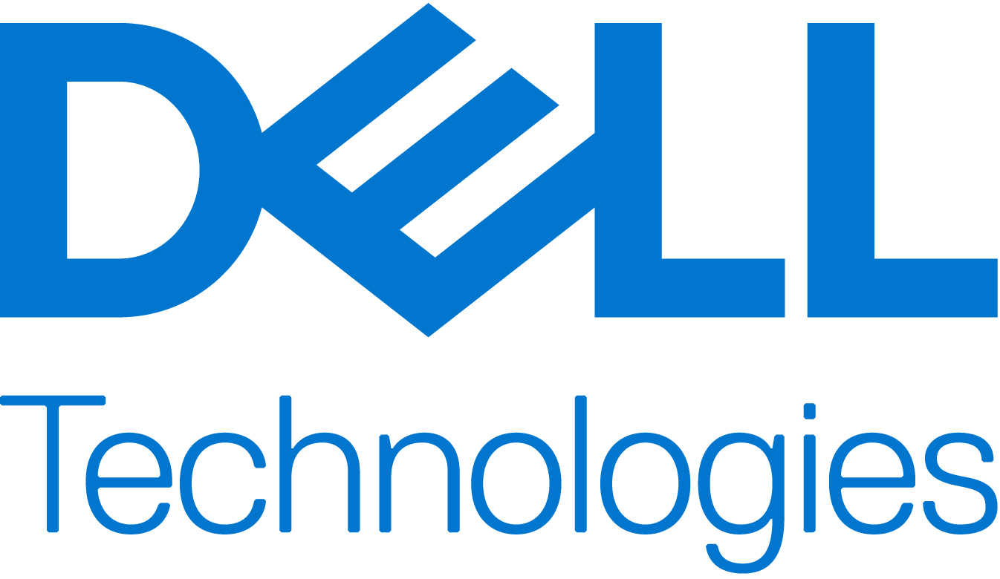

.. Omnia documentation master file, created by
   sphinx-quickstart on Thu Jul 28 11:20:32 2022.
   You can adapt this file completely to your liking, but it should at least
   contain the root `toctree` directive.

Omnia: Everything at once!
----------------------------------

|Omnia version| |Downloads| |Last Commit| |Commits Since 1.4.3| |Contributors| |Forks| |License|

Ansible playbook-based deployment of Slurm and Kubernetes on servers running an RPM-based Linux OS.

**Omnia** (Latin: all or everything) is a deployment tool to turn servers with RPM-based Linux images into functioning Slurm/Kubernetes clusters.

**Omnia** is an open source project hosted on `GitHub <https://github.com/dell/omnia>`_. Go to `GitHub <https://github.com/dell/omnia>`_ to view the source, open issues, ask questions, and participate in the project.

**Licensing**

Omnia is made available under the `Apache 2.0 license. <https://opensource.org/licenses/Apache-2.0>`_

.. note:: Omnia playbooks are licensed under the Apache 2.0 license.  Once an end-user initiates Omnia, that end-user will enable deployment of other open source software that is licensed separately by their respective developer communities. For a comprehensive list of software and their licenses, `click here <Overview/SupportMatrix/omniainstalledsoftware.html>`_ . Dell (or any other contributors) shall have no liability regarding and no responsibility to provide support for an end-users use of any open source software and end-users are encouraged to ensure that they are complying with all such licenses.  Omnia is provided “as is” without any warranty, express or implied.  Dell (or any other contributors) shall have no liability for any direct, indirect, incidental, punitive, special, or consequential damages for an end-users use of Omnia.

For a better understanding of what Omnia does, check out our `docs <https://omnia-doc.readthedocs.io/en/latest/index.html>`_!

**Omnia Community Members**

.. image:: https://upload.wikimedia.org/wikipedia/commons/0/0e/Intel_logo_%282020%2C_light_blue%29.svg
    :width: 60pt

.. image:: images/logos/pisa.png
  :width: 60pt

.. image:: https://user-images.githubusercontent.com/83095575/117071024-64956c80-ace3-11eb-9d90-2dac7daef11c.png
  :width: 60pt

.. image:: https://www.vizias.com/uploads/1/1/8/9/118906653/published/thick-blue-white-ring-letters-full.png
    :width: 60pt

.. image:: https://user-images.githubusercontent.com/5414112/153955170-0a4b199a-54f0-42af-939c-03eac76881c0.png
  :width: 60pt

.. image:: images/logos/Liqid.png
   :width: 60pt

**Table Of Contents**

.. toctree::
   Overview/index
   InstallationGuides/index
   Roles/index
   Logging/index
   Troubleshooting/index
   SecurityConfigGuide/index
   samplefiles
   limitations
   bestpractices
   Contributing/index
   appendix

.. |Omnia version| image:: https://img.shields.io/github/v/release/dell/omnia?include_prereleases
.. |Downloads| image:: https://img.shields.io/github/downloads/dell/omnia/total
.. |Last Commit| image:: https://img.shields.io/github/last-commit/dell/omnia/main
.. |Commits Since 1.4.3| image:: https://img.shields.io/github/commits-since/dell/omnia/v1.4.3/main
.. |Contributors| image:: https://img.shields.io/github/all-contributors/dell/omnia
   :target: docs/CONTRIBUTORS.md
   :alt: Contributors
.. |Forks| image:: https://img.shields.io/github/forks/dell/omnia
.. |License| image:: https://img.shields.io/github/license/dell/omnia
   :target: LICENSE
   :alt: Repository License

