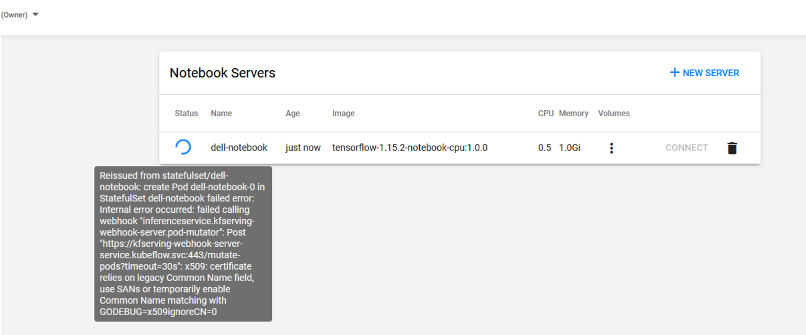
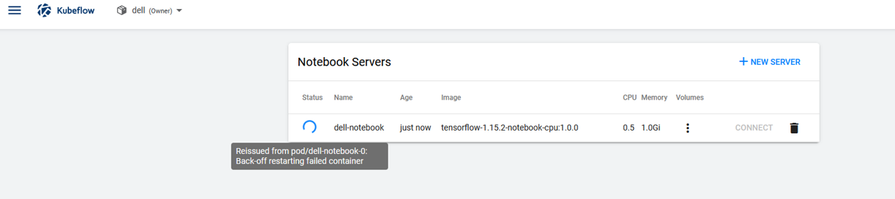
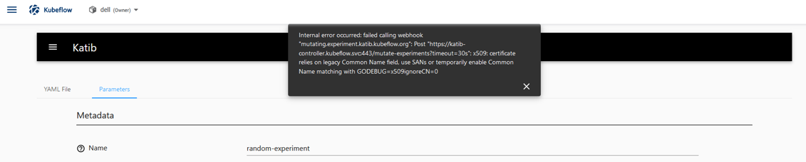

# KF Notebook creation issue (ressoved)
## kf-serving webhook error:

While creating Notebook on kubeflow UI, if this error apear need to patch kf-serving. Use the below command to patch the kf-serving webhook and re-create notebook
```
kubectl patch mutatingwebhookconfiguration inferenceservice.serving.kubeflow.org --patch '{"webhooks":[{"name": "inferenceservice.kfserving-webhook-server.pod-mutator","objectSelector":{"matchExpressions":[{"key":"serving.kubeflow.org/inferenceservice", "operator": "Exists"}]}}]}'
```
Output:
```
mutatingwebhookconfiguration.admissionregistration.k8s.io/inferenceservice.serving.kubeflow.org patched
```



If this error appears then run below commands in all master nodes as well as all the worker nodes and re-create the Nootbook.

1.
```
sudo modprobe ip_tables
```
2.
```
sudo echo 'ip_tables' >> /etc/modules
```
---
## Katib certification error:


To resolve katib certification error, need to create below json files with following contents: 

1. 
```
vi ca-csr.json
```
Insert below content and save it. 

```
{
    "CN": "katib-controller.kubeflow.svc",
    "hosts": [
        "katib-controller.kubeflow.svc"
    ],
    "key": {
        "algo": "ecdsa",
        "size": 256
    },
    "names": [
        {
            "C": "US",
            "ST": "CA",
            "L": "San Francisco"
        }
    ]
}
```
2. 

```
vi server-csr.json
```
Insert below content and save it.

```
{
    "CN":"katib-controller.kubeflow.svc",
    "hosts":[
        "katib-controller.kubeflow.svc"
    ],
    "key":{
        "algo":"rsa",
        "size":2048
    },
    "names":[
        {
            "C":"US",
            "L":"CA",
            "ST":"San Francisco"
        }
    ]
}
```
3. 

```
vi ca-config.json
```
Insert below content and save it.

```
{
    "signing": {
        "default": {
            "expiry": "168h"
        },
        "profiles": {
            "www": {
                "expiry": "8760h",
                "usages": [
                    "signing",
                    "key encipherment",
                    "server auth"
                ]
            },
            "client": {
                "expiry": "8760h",
                "usages": [
                    "signing",
                    "key encipherment",
                    "client auth"
                ]
            },
            "kubernetes": {
                "expiry": "876000h",
                "usages": [
                    "signing",
                    "key encipherment",
                    "server auth",
                    "client auth"
                    ]
            }
        }
    }
}
```

4. From there you can run (note the kubernetes profile used):

    a.  Generating SSL certs
    ```
    cfssl gencert -initca ca-csr.json | cfssljson -bare ca –
    ```
    ```
    cfssl gencert -ca=ca.pem -ca-key=ca-key.pem -config=ca-config.json -profile=kubernetes server-csr.json | cfssljson -bare server
    ```
    b. Needed renaming
    ```
    mv ca.pem ca-cert.pem
    ```
    ```
    mv server.pem cert.pem
    ```
    ```
    mv server-key.pem key.pem
    ```
    c.  K8S secret refresh
    ```
    kubectl delete secret -n kubeflow katib-controller
    ```
    ```
    kubectl create secret -n kubeflow generic katib-controller --from-file=ca-cert.pem --from-file=ca-key.pem --from-file=cert.pem --from-file=key.pem
    ```